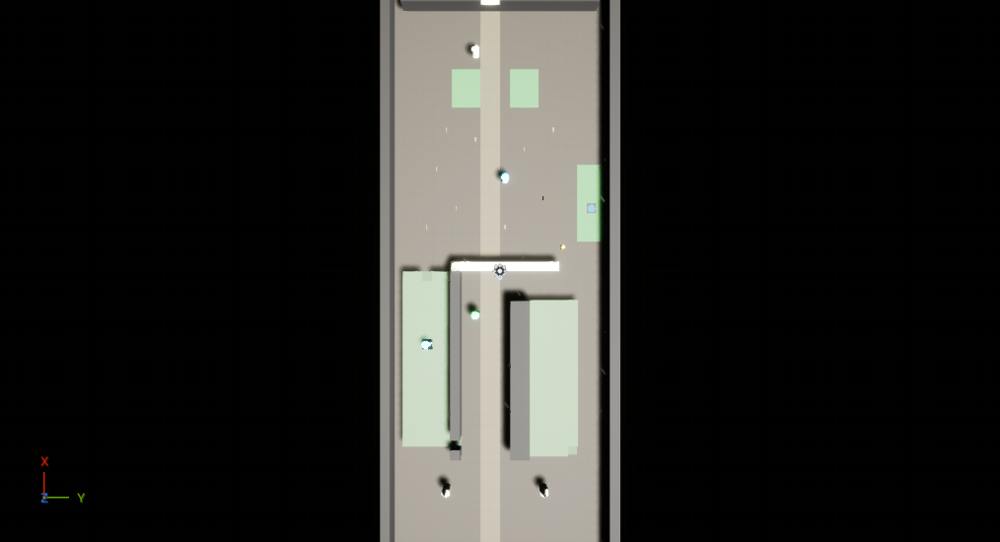
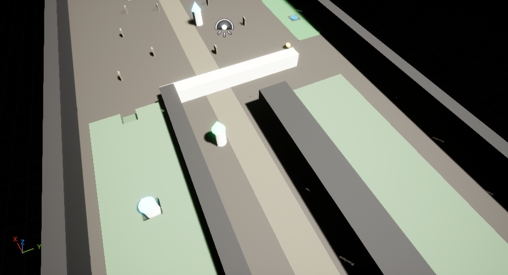

# 白骨迎宾道 · Bone Welcome

**反塔防（Reverse Tower Defense）Demo — UE 5.8**

你不建塔。你指挥怪物大军，拆别人的塔。

从左侧裂隙出发，沿白骨路向东推进：拆 11 堵骨墙（墙破会惊醒墓碑、爆出骷髅伏击）、推掉 6 座亡灵塔、最终摧毁最东端的**亡者之门**。你的**领主**阵亡则满盘皆输。



## 怎么玩

在 UE 编辑器中打开 `BoneWelcome/BoneWelcome.uproject`（需要 Unreal Engine 5.8），确认地图 `L_Level01`，按 `Alt+P` 开局：

| 操作 | 效果 |
|---|---|
| 左键点兵 | 选中（Shift 加选 / 点空地取消） |
| 右键点敌人 | 集火（塔 / 骷髅 / 门 / 墙） |
| 右键点地面 | 移动 |
| `1` `2` `3` `4` | 花魂能出兵：食尸鬼 25 / 骸骨射手 40 / 石肤巨魔 150 / 瘟疫使徒 120 |
| `Q` | 领主技能：身边召唤 4 个食尸鬼（60s 冷却） |

开局自带 15 个兵 + 100 魂能。拆塔 +50，破墙 +20，封印裂隙 +80。
骷髅是塔的卫兵：守家 5 格圈，绝不打你的领主。



## 仓库结构

```
BoneWelcome/          UE 5.8 工程（蓝图全部运行时生成，无 C++）
  Content/Design/     level01_map.json —— 唯一设计数据源（地图/数值/经济/规则）
  Content/Blueprints/ 9 个蓝图：Director 驱动 + 兵种 + 塔 + 骷髅守卫 + 门/墙 + 领主 + 控制器
  PROJECT_REPORT.md   完整交接报告（架构契约 / 验证清单 / 已知问题 / MCP 工具坑）
bone-welcome/         网页参考原型（规则母版 + 引擎测试，已被 UE 版取代，仅存档）
docs/                 设计稿与截图
```

## 当前进度

- [x] M1 关卡几何（64×24 地图、地形合并、夜光冷调）
- [x] M2-1 战斗闭环（出兵/点选/集火/四种塔/骷髅守卫/胜负判定，PIE 冒烟通过）
- [ ] M2-2 挖掘点、裂隙封印、UMG HUD
- [ ] M3 门卫平衡、完整实机验收

详见 [BoneWelcome/PROJECT_REPORT.md](BoneWelcome/PROJECT_REPORT.md)。
